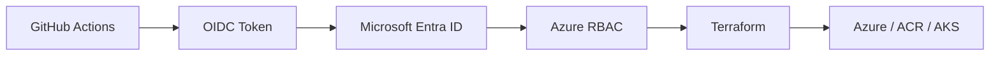

# app-demo

A minimal FastAPI application used as the reference workload for a three-repository
DevOps platform homework project: application code, reusable CI/CD building blocks,
and Azure infrastructure-as-code, wired together with GitHub Actions, Docker, Helm,
Terraform, and OIDC-based authentication to Azure (no client secrets anywhere).

## Architecture

**Application delivery flow** (this repository, on every push to `main`):

```mermaid
flowchart LR
    A[Developer] --> B[Feature Branch]
    B --> C[Pull Request]
    C --> D[CI + Security]
    D --> E[Review / Quality Gate]
    E --> F[main]
    F --> G[Docker Build once]
    G --> H[ACR]
    H --> I[Helm DEV]
    I --> J[Smoke Test]
    J --> K[PROD Approval]
    K --> L[Helm PROD]
```



**Azure authentication and provisioning path** (used by both this repository's
deploy pipeline and `terraform-infra`'s pipeline):



No long-lived Azure credentials or client secrets are stored anywhere in either
flow - every identity authenticates via a short-lived, federated OIDC token.

## Repository structure

The platform is split across three repositories, each with a single responsibility:

| Repository | Responsibility |
|---|---|
| **app-demo** (this repo) | The FastAPI application, its tests, Dockerfile, Helm chart, and the CI/CD workflow that builds, scans, and deploys it. |
| **platform-workflows** | Centralized, reusable GitHub Actions workflows (`workflow_call`) shared across repositories: Python tests, security scanning, Docker image scanning, build-and-push, Helm deploy, smoke test. |
| **terraform-infra** | Terraform configuration that provisions the underlying Azure infrastructure (Resource Group, ACR, AKS, namespaces) and its own CI/CD pipeline for `plan`/`apply`. |

## Infrastructure deployment with Terraform

`terraform-infra` is deliberately split into two independently-applied stages to
avoid a fragile first apply:

- **Root stage** - Resource Group, Azure Container Registry, AKS cluster, and the
  `AcrPull` RBAC role assignment that lets AKS pull images from ACR.
- **`kubernetes/` stage** - the `dev` and `prod` Kubernetes namespaces, applied
  separately once the cluster already exists (it reads the cluster back via a
  data source rather than referencing a resource still being created).

### Terraform remote state

State is stored remotely in an Azure Storage Account (not on any local disk),
with each stage writing to its own blob (`terraform-infra.tfstate` and
`terraform-infra-kubernetes.tfstate`) inside the same storage account. The
backend authenticates using Azure AD (`use_azuread_auth = true`) instead of a
storage account access key, so no storage secret ever appears in configuration
or CI.

### Plan on PR, manual approval before apply on main

- **Pull requests** run `terraform fmt -check`, `init`, `validate`, and `plan`
  using a dedicated **PLAN** identity that holds `Reader`,
  `Storage Blob Data Reader`, and `Azure Kubernetes Service Cluster User Role`
  (needed only so Terraform can retrieve AKS user credentials during
  refresh/plan) - it still cannot create, modify, or delete anything in
  Azure, even if a malicious PR's Terraform code tried to.
- **Push to `main`** runs under a separate **APPLY** identity (`Contributor` +
  `Role Based Access Control Administrator` + `Storage Blob Data Contributor`),
  but only after a dedicated approval job gated behind the `infra-prod` GitHub
  Environment succeeds - a human must approve before either `apply` stage runs.

## GitHub Actions CI flow (app-demo)

Every pull request into `main` triggers `pr-checks.yml`, which calls three
reusable workflows from `platform-workflows`:

1. **Python tests** - installs dependencies, runs `pytest`.
2. **Security scan** - Bandit (SAST), pip-audit (SCA), and Gitleaks (secret
   scanning), each as its own job.
3. **Docker image scan** - builds the image and scans it with Trivy, failing
   on any HIGH or CRITICAL vulnerability.

`cicd.yml`'s own pull-request job additionally runs the test suite once more
and does a throwaway `docker build` purely to verify the Dockerfile still
builds - nothing is pushed or deployed from a pull request.

## GitHub Actions CD flow (app-demo)

On push to `main`, `cicd.yml` orchestrates four jobs, each calling a reusable
workflow from `platform-workflows`:

```
build-and-push -> deploy-dev -> smoke-test -> deploy-prod
```

- **build-and-push** - builds the image once, tagged with the Git commit SHA,
  scans it with Trivy, and only pushes it to ACR if the scan passes.
- **deploy-dev** - deploys that image to the `dev` namespace with Helm.
- **smoke-test** - port-forwards to the `dev` Service and checks `/health`
  actually responds before anything is allowed near `prod`.
- **deploy-prod** - deploys the *same* image to the `prod` namespace, gated by
  the `prod` GitHub Environment's required-reviewer approval.

## OIDC authentication to Azure

No workflow in any of the three repositories uses a client secret. Every job
that talks to Azure exchanges a short-lived GitHub-issued OIDC token for an
Azure AD access token via a **Federated Identity Credential** - a trust
relationship configured once in Azure AD between an App Registration and a
specific GitHub OIDC subject (e.g. "this exact repo, on `main`" or "this exact
repo, in the `prod` Environment"). Azure only issues a token if the calling
workflow run's subject matches exactly.

### Federated credentials and least privilege

Separate identities are used for separate levels of trust, each holding only
the Azure RBAC roles it actually needs:

| Identity | Used for | Azure roles |
|---|---|---|
| Terraform **PLAN** | Pull requests in `terraform-infra` | `Reader`, `Storage Blob Data Reader`, `Azure Kubernetes Service Cluster User Role` |
| Terraform **APPLY** | Push to `main` in `terraform-infra` | `Contributor`, `Role Based Access Control Administrator`, `Storage Blob Data Contributor` |
| `github-app-demo-deploy` | Build/deploy in `app-demo` | `AcrPush` on ACR, `Azure Kubernetes Service Cluster User Role` on AKS |

Deploying to `dev` and `prod` uses environment-scoped OIDC subjects, so the
identity's token is only ever issued for a workflow run that GitHub itself
confirms is running under that specific, approval-gated Environment.

## Security scanning

Every change is checked by five independent tools, each catching a different
class of problem before it reaches `main` or a running container:

- **pytest** - the application's own unit tests.
- **Bandit** - static analysis of the Python source code (SAST).
- **pip-audit** - known vulnerabilities in third-party dependencies (SCA).
- **Gitleaks** - accidentally committed credentials (secret scanning).
- **Trivy** - vulnerabilities in the built container image's OS packages and
  installed dependencies, failing the build on HIGH or CRITICAL findings.

## Docker image

The `Dockerfile` is a multi-stage build on an Alpine base: dependencies are
installed in a throwaway builder stage, and only the application code and
installed packages are copied into the final image. The container runs as a
dedicated non-root user, never root.

## Azure Container Registry & AKS

- **ACR** has its admin username/password disabled entirely
  (`admin_enabled = false`); the only way to pull or push is via Azure RBAC.
- **AKS** hosts two namespaces, both created by Terraform: `dev` and `prod`.

## Helm chart

The chart lives at `helm/app-demo/`. `values.yaml` holds shared defaults;
`values-dev.yaml` and `values-prod.yaml` override only what genuinely differs
per environment:

| | DEV | PROD |
|---|---|---|
| Replicas | 1 | 2 |
| Resources | lower requests/limits | higher requests/limits |
| `APP_ENV` | `dev` | `prod` |

Neither values file ever sets the image tag - that is supplied at deploy time
via `--set image.tag=<sha>`, which is what makes Build Once, Promote Many
possible.

## Build Once, Promote Many

The image built by `build-and-push` is tagged once with the triggering
commit's Git SHA. That exact tag is passed as an explicit job output, and both
`deploy-dev` and `deploy-prod` receive the identical value - the image is
never rebuilt for `prod`. What changes between environments is only the Helm
values file and the target namespace, never the image.

## Deployment flow

1. **DEV deployment** - `helm upgrade --install` into the `dev` namespace with
   `values-dev.yaml` and the new SHA-tagged image.
2. **Smoke test** - an independent job fetches its own AKS credentials,
   port-forwards to the `dev` Service, and confirms `/health` returns a
   healthy response before proceeding.
3. **GitHub Environment manual approval** - the `prod` Environment requires a
   human reviewer to approve before the next job is allowed to run.
4. **PROD deployment** - the same reusable Helm-deploy workflow runs again,
   this time with `values-prod.yaml`, the `prod` namespace, and the exact same
   image tag that was just verified in DEV.

## Rollback

Because every deploy is a Helm release, rolling back does not require a new
build:

- **Helm rollback** - `helm rollback app-demo <revision> -n <namespace>`
  reverts the release to a previous, already-recorded revision.
- **Redeploy a previous image tag** - since every image is tagged with an
  immutable Git SHA (never `latest`), an older, known-good version can be
  redeployed by running the same Helm-deploy workflow with
  `--set image.tag=<previous-sha>`, as long as that tag hasn't since been
  removed by ACR's own retention/cleanup policy. ACR stores SHA-tagged images
  until they are explicitly removed or deleted by a configured
  retention/cleanup policy.

## GitHub governance

- All changes go through a **feature branch** and a **pull request** into
  `main` - direct pushes and force-pushes to `main` are blocked by a
  repository Ruleset.
- **CODEOWNERS** (`.github/CODEOWNERS`) makes the `platform` team the required
  code owner for the entire repository.
- The Ruleset on `main` requires at least one approving **reviewer** and all
  **required status checks** (tests, security scan, Docker scan) to pass
  before a pull request can be merged.
